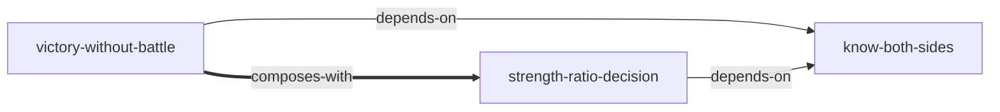

# 《孙子兵法·谋攻篇》 — Skill Index

> 本篇由 cangjie-skill 蒸馏, 共产出 **3** 个 skills。
> 处理时间: 2026-07（示例）

## 关于这篇内容

- **作者**: 孙武
- **成书年代**: 春秋末期（公版文本）
- **一句话主旨**: 胜利的上策是不经交战使敌人屈服，为此按成本阶梯选手段、按实力比选动作，而一切判断的前提是知彼知己
- **整体理解**: 见 [BOOK_OVERVIEW.md](./BOOK_OVERVIEW.md)
- **精华长文** (不读原文看这篇): [DIGEST.md](./DIGEST.md)
- **术语词典**: [GLOSSARY.md](./GLOSSARY.md)

---

## Skill 列表 (按主题分组)

### 冲突与竞争策略

- [`victory-without-battle`](./victory-without-battle/SKILL.md) — 面对冲突先排手段成本阶梯（伐谋→伐交→伐兵→攻城），不把最高破坏手段当默认选项
- [`strength-ratio-decision`](./strength-ratio-decision/SKILL.md) — 由敌我实力比决定可行动作（围/攻/分/战/逃/避），禁止用意志替代计算

### 决策前提

- [`know-both-sides`](./know-both-sides/SKILL.md) — 重大决策前按"知彼/知己"两栏审计信息完备度，缺哪栏先补哪栏

---

## 引用图



图例:
- `-->`  depends-on
- `===>` composes-with

---

## 推荐学习顺序

(从依赖图的叶子节点开始, 向上)

1. **know-both-sides** — 最基础，没有前置；另外两个 skill 的信息输入都来自它
2. **victory-without-battle** — 依赖 know-both-sides 提供对方计划/联盟信息
3. **strength-ratio-decision** — 依赖 know-both-sides 提供敌我数据；与 victory-without-battle 组合使用（先选层级，再定动作）

---

## 安装使用

本目录是构建产物, 宿主不会从这里加载 skill。要让 agent 真正调用, 把 skill 目录复制到宿主的 skills 目录:

```bash
# 用户级 (所有项目可用)
cp -r victory-without-battle ~/.claude/skills/

# 或项目级
cp -r victory-without-battle <project>/.claude/skills/    # Claude Code
cp -r victory-without-battle <project>/.cursor/skills/    # Cursor
```

---

## 接入 darwin-skill

所有 skill 均带有 `test-prompts.json` (darwin-skill 兼容格式), 可直接接入自动进化:

```
darwin evolve examples/sunzi-mougong/
```

---

## 审计轨迹

- 候选单元池: [candidates/](./candidates/)
- 被淘汰的候选 (含原因): [rejected/](./rejected/)
- BOOK_OVERVIEW: [BOOK_OVERVIEW.md](./BOOK_OVERVIEW.md)
